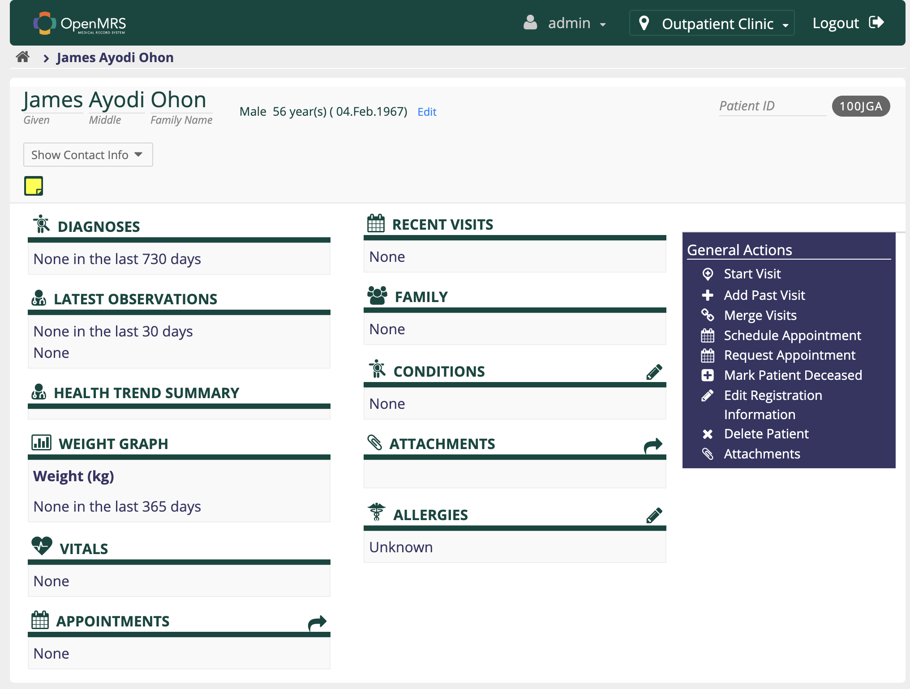
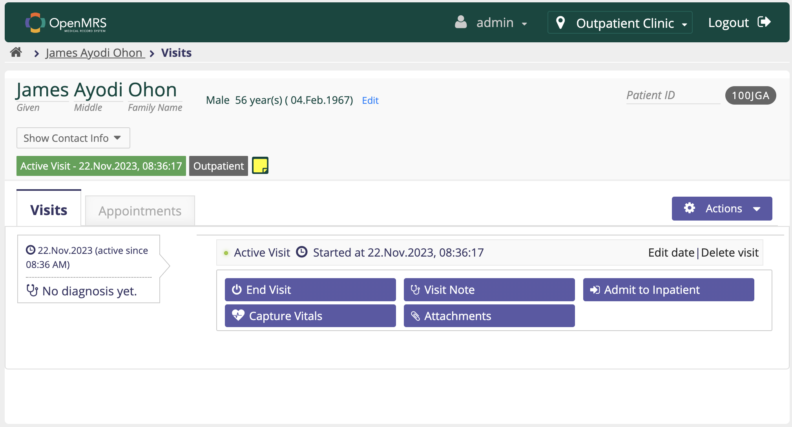
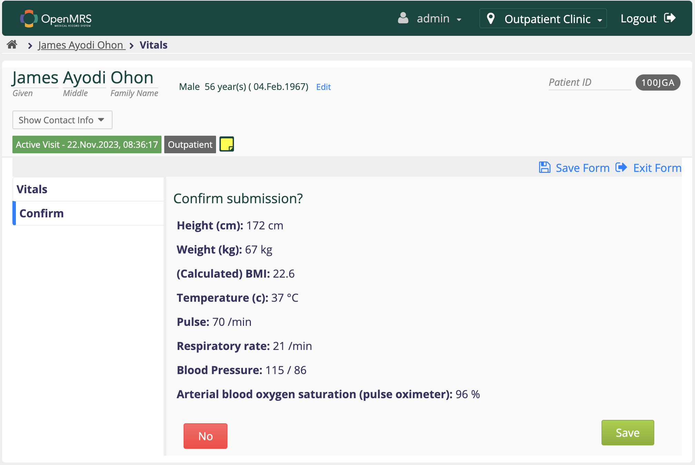
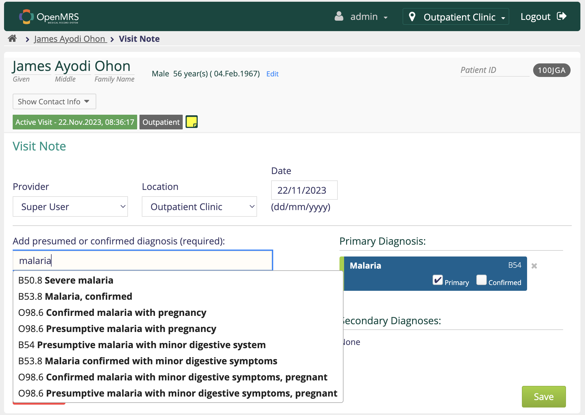
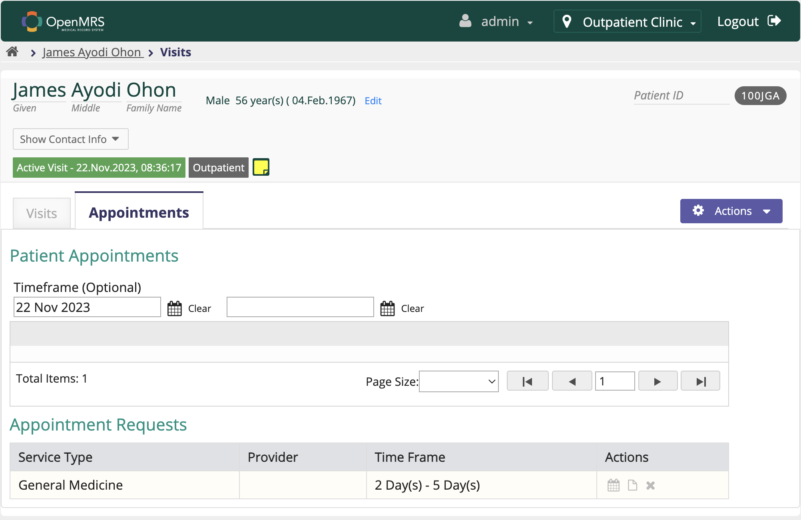

# Outpatient Module

Refers to a specific component or segment of a larger health information system that is dedicated to managing and facilitating outpatient care services. The outpatient module is designed to streamline and organize the processes related to patient care provided on an outpatient basis, where individuals receive medical treatment without being admitted to a hospital or staying overnight.

## Key features of an outpatient module

- **Appointment Scheduling:** Allows for the scheduling and management of outpatient appointments, ensuring efficient use of healthcare resources and minimizing patient wait times.

- **Patient Registration:** Captures and maintains essential patient information, including demographics, contact details, and medical history relevant to outpatient care.

- **Visit Documentation:** Records and manages information about each outpatient visit, including symptoms, diagnosis, prescribed medications, and treatment plans.

- **Billing and Payment:** Manages financial aspects of outpatient care, including billing for services rendered, processing insurance claims, and handling patient payments.

- **Prescription Management:** Facilitates the ordering, dispensing, and tracking of prescription medications prescribed during outpatient visits.

- **Diagnostic Tests and Results:** Integrates with laboratory and imaging systems to request, record, and retrieve diagnostic test results for outpatient cases.

- **Follow-up and Referral Management:** Supports the scheduling of follow-up appointments and facilitates referrals to specialists or additional healthcare services as needed.

- **Reporting and Analytics:** Provides tools for generating reports and analytics related to outpatient services, aiding in performance assessment and decision-making.

- **Integration with Electronic Health Records (EHR):** Ensures seamless integration with the overall electronic health record system, allowing for a comprehensive view of a patient's medical history.

## OpenMRS Implementation of the Outpatient Module

### Patient Registration: 

I registered a patient by name _James Ayodi Ohon_ born on _4th Feb, 1967_. Below are the registration details.

I started a visit for this _James Ayodi Ohon_ as shown below:

I captured vitals as shown below:

I added visit note for _James Ayodi Ohon_ as shown below. The diagnosis presumed from laboratory test from lab module allows me to select from ICD-11.

After selection of the _Primary Diagnosis_ from the list, I added clinical notes relevant to the diagnosis in the text box. After this I added the next appointment date as shown below:

